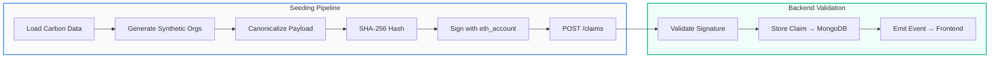
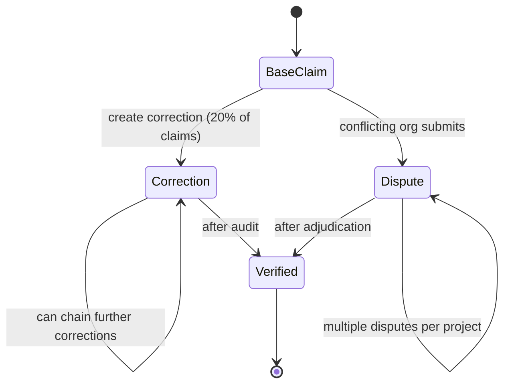
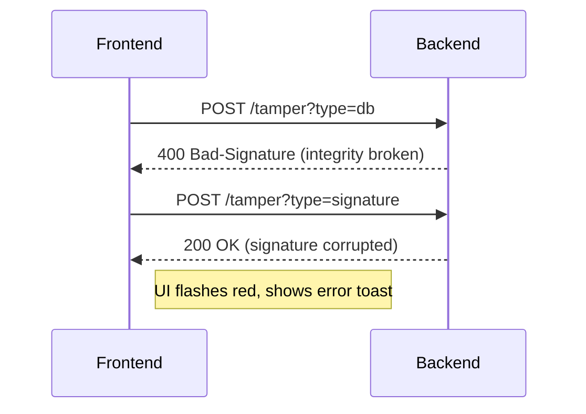

# 🎉 **Chlorophyll – The Wild, Decentralized Environmental Data Provenance Playground**

> **⚡️ TL;DR:** A mind‑blowing demo of crypto‑backed carbon claim logging, corrections, disputes, and a mischievous *Tamper Lab* that lets you smash data and watch the blockchain scream.  All glammed‑up with vibrant CSS, glass‑morphism dashboards, and **MERMAID** flowcharts that even your cat can read.

---

## 🌈 1. What the Heck Is This?

Chlorophyll is a **full‑stack** prototype that shows how you can:

1. **Collect** real‑world carbon project data (from OWID or a built‑in Berkeley dataset).
2. **Canonicalize → Hash → Sign** every claim with an Ethereum key (no private‑key leaks!).
3. **Anchor** the hash on‑chain (via `DataProvenance.sol`).
4. **Validate** the chain of custody on the backend using deterministic replay.
5. **Correct** or **dispute** claims – all tracked immutably.
6. **Play** with a UI that lets you deliberately corrupt data and watch integrity checks fail (the *Tamper Lab*).

It’s a **show‑case** for auditors, regulators, and anyone who loves watching cryptographic magic happen in real‑time.

---

## 🧩 2. Architecture Overview (Mermaid 🧙‍♂️) 

```mermaid
graph TD;
    subgraph LocalDev[Local Development]
        A[Anvil (Ethereum testnet)] -->|Deploy| C[DataProvenance.sol]
        A -->|Deploy| O[OrgRegistry.sol]
        B[MongoDB Atlas] -->|Fallback| J[JSON DB]
        D[Express Backend] -->|REST| E[Frontend (React+Vite)]
        D -->|Calls| C
        D -->|Reads| B
        D -->|Fallback| J
    end
    subgraph MLService[ML‑Seed Service]
        M[seed.py] -->|POST /claims| D
        M -->|GET OWID CSV| W[OWID CO₂ Data]
        M -->|Embedded JSON| K[Berkeley Projects]
    end
    subgraph UI[User Interface]
        E -->|List| L[Claims Directory]
        E -->|Wizard| U[Update Claim Wizard]
        E -->|Lab| T[Tamper Lab]
        E -->|Panel| P[Disputes Panel]
    end
    classDef blockchain fill:#0a0a0a,color:#fff,stroke:#22c55e;
    class C,O blockchain;
``` 

---

## 🚀 3. Data Flow – From Seed to On‑Chain (Mermaid Flowchart)



---

## 🔄 4. Claim Lifecycle (Correction & Dispute)  



---

## 🛠️ 5. Tech Stack (the *cool* stuff)

| Layer | Technology |
|-------|------------|
| **Blockchain** | Solidity smart contracts (`DataProvenance.sol`, `OrgRegistry.sol`) compiled with **Foundry** |
| **Backend** | Node.js **Express** server, **MongoDB Atlas** (+ JSON fallback) |
| **Frontend** | React + Vite (vanilla CSS with premium glass‑morphism) |
| **ML / Data Seeder** | Python 3 script (`seed.py`) using **eth‑account** & **requests** |
| **Dev Tools** | Anvil (local Ethereum), **npm**, **pip**, **Foundry**, **Git** |

---

## 📦 6. Getting Started – One‑Click Chaos (Step‑by‑Step) 

```bash
# 1️⃣ Clone the repo (you’re already here)
# cd D:/Study/Hackthon/Decentralized   <-- skip if inside

# 2️⃣ Spin up a local Ethereum node (Anvil)
anvil --host 127.0.0.1 --port 8545 &

# 3️⃣ Compile & Deploy contracts
cd contracts
forge build
forge script script/Deploy.s.sol --rpc-url http://127.0.0.1:8545 --broadcast
cd ..

# 4️⃣ Install & Run backend (will auto‑fallback to JSON if Atlas down)
cd backend
npm install
npm start   # => http://localhost:5000/api
cd ..

# 5️⃣ Seed the database (Python env recommended)
cd ml-service
python -m venv .venv && .\.venv\Scripts\activate
pip install eth-account requests
# EDIT API_URL in seed.py or export env var
$env:API_URL="http://localhost:5000/api"
python seed.py
cd ..

# 6️⃣ Build & Serve the frontend (it proxies to backend)
cd frontend
npm install
npm run build   # static assets copied to backend/public
# If you want hot‑reload dev server instead:
# npm run dev
cd ..
```

> **💡 Pro‑Tip:** The seed script pauses `0.4s` between transactions – tweak if you run on a fast testnet.

---

## 🎨 7. UI Tour – *What’s That Shiny Button?*

| Section | What It Does |
|---------|--------------|
| **Claims Directory** | Paginated, horizontally‑scrollable table (no clipping!) showing all claims with status badges. |
| **Update Claim Wizard** | 3‑step UI: pick claim → diff view → 4‑point cryptographic audit (signature, hash, parent‑hash, ecrecover). |
| **Tamper Lab** | Click **“Corrupt DB”** or **“Corrupt Signature**” – the backend instantly flags integrity failures (great for demos). |
| **Disputes Panel** | Shows conflicting claims from different orgs; you can adjudicate or let the system flag inconsistencies. |
| **Verify Signer** | Paste any claim hash + signature and watch the recovered address appear like magic. |

---

## 📊 8. Visual Gallery (Mermaid + Screenshots) 

### 8.1 Claim Flow Diagram (already above)

### 8.2 Tamper Lab Interaction (Mermaid)



---

## 🧪 9. Run the Tests (if you’re feeling brave) 

```bash
# Backend tests (Jest)
cd backend && npm test

# Frontend tests (Vitest)
cd frontend && npm run test

# Python seed sanity check (dry‑run)
cd ml-service && python -m pytest   # (add tests yourself!)
```

---

## 🤝 10. Contributing – Let the Madness Continue

1. Fork the repo.
2. Create a **feature/** branch with a crazy‑name (e.g., `feature/laser‑claims`).
3. Follow the **Git‑flow**: PR → review → merge.
4. Keep the **README** wild – add more mermaid diagrams, GIFs, or ASCII art.
5. Bonus points: add a **GitHub Action** that auto‑generates a flowchart from your `seed.py` docstrings.

---

## 📜 11. License

MIT – because we like open chaos.

---

## 🎉 12. Finale – Why This Is *Awesome*

- **Zero‑trust data provenance** – every claim is cryptographically bound to an on‑chain identity.
- **Dynamic corrections** – you can edit claims *after* anchoring, with a full immutable audit trail.
- **Dispute engine** – multiple orgs can clash, and the system surfaces the conflict instantly.
- **Tamper Lab** – a built‑in “break‑it‑and‑see‑what‑happens” sandbox that delights auditors.
- **Glass‑morphic UI** – looks like a sci‑fi control panel, not a boring admin panel.
- **All‑in‑one repo** – from Solidity contracts to Python seeders to React UI, everything lives together.

*Now go forth, deploy, tamper, and brag about the most **crazy** README on GitHub!*
