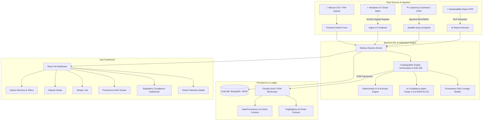

# GreenProof — Master System Architecture & Solution Specification

> **Environmental Evidence Provenance & Verification Network**
> Cryptographically Secured, Multi-Domain Environmental Data Infrastructure with AI Consistency Auditing, Hardware/Satellite Oracles, Directed Acyclic Graph (DAG) Provenance Lineage, Intelligent Dispute Resolution, and Automated EU CSRD / GHG Protocol Regulatory Compliance.

---

## Executive Summary & Solution Vision

Modern corporate sustainability reporting, carbon credit markets, and environmental regulatory compliance suffer from **greenwashing, data fragmentation, opaque manual Excel spreadsheets, and retroactive record tampering**. Existing registries often rely on trusted central authorities without cryptographic mathematical proof of data integrity or lineage.

**GreenProof** solves this by establishing a decentralized, multi-domain **Environmental Evidence Verification Network**. Every environmental claim (across Carbon, Water, Air, Waste, Deforestation, and Renewable Energy) is:
1. **Canonicalized and Hashed**: Converted into a deterministic SHA-256 cryptographic digest.
2. **Cryptographically Signed**: Authenticated via ECDSA (`secp256k1`) by verified organization wallets or hardware IoT sensors.
3. **Anchored On-Chain**: Immutable 1-to-1 anchor recorded on EVM Smart Contracts (`DataProvenance.sol`).
4. **Lineage-Linked (DAG)**: Connected to parent claims forming a tamper-evident Directed Acyclic Graph (DAG) of version history and corrections.
5. **Audited by AI**: Checked deterministically for mathematical consistency, time-series statistical anomalies (IQR / Z-Score), and NLP sustainability report extraction.
6. **Zero-Human Oracles**: Direct zero-human-in-the-middle telemetry ingestion from IoT smart meters and Copernicus Sentinel-2 STAC satellite remote sensing.
7. **Automated Regulatory Mapping**: Auto-classified into GHG Protocol Scopes 1–3 and EU CSRD / ESRS E1–E5 standards with one-click Audit-Ready Compliance Package exports.

---

## High-Level System Architecture



---

## 3. Tech Stack & Infrastructure

| Tier | Technologies Used | Rationale / Purpose |
| :--- | :--- | :--- |
| **Frontend UI** | React 18, Vite 5, Vanilla CSS / Tailwind CSS, Lucide Icons | High-performance SPA with vibrant glassmorphic design and real-time state reactivity. |
| **Backend REST API** | Node.js, Express.js | Non-blocking API routing, cryptographic payload processing, and AI engine integration. |
| **Database Tier** | MongoDB (Mongoose) + Local JSON Fallback (`db_claims.json`, `db_orgs.json`) | Dual-mode resilience; guarantees zero downtime even if MongoDB service is offline. |
| **Blockchain / EVM** | Solidity 0.8.20, Foundry Anvil, Ethers.js v6 | On-chain immutable hash anchoring (`DataProvenance.sol`) and key management (`OrgRegistry.sol`). |
| **Cryptography** | ECDSA `secp256k1`, SHA-256, `ethers.verifyMessage` | Math-level evidence verification, zero-trust signer recovery, and payload canonicalization. |
| **AI / ML Services** | Python 3.10+, Scikit-Learn, NumPy, SciPy, Regex NLP | Outlier detection (IQR & Z-Score), ratio calculation, and report parsing. |
| **Satellite Oracles** | Copernicus Sentinel-2 STAC REST API | Earth Observation spectral indices (NDVI canopy, NDWI water, thermal gas absorption). |

---

## Complete Database Schemas & Data Models

### 1. `ClaimSchema` (Main Environmental Claim Model)

Stored in MongoDB collection `claims` or file `backend/db_claims.json`:

```json
{
  "claimId": "seed-v3-claim-001",
  "projectId": "OWID-AFG-2022",
  "projectName": "Afghanistan National GHG Reduction Goal (2022)",
  "region": "Afghanistan",
  "projectType": "Nationally Determined Contribution (NDC)",
  "environmentalDomain": "carbon",
  "metric": "CO2 emissions",
  "value": 201,
  "unit": "tonnes CO2e",
  "period": "2025",
  "tonnage": 201,
  "orgId": "0x7af5033d9de99d00c48713579f597885fec52c41",
  "hash": "31f573af45e5c8f7b5c42e4154dea5e82cdd8d9c27e7bb80fbb3d56201c96ced",
  "signature": "0x4113ef62dbaa219aae0aa18511a75c474a10420cac8cb470cf2bfc1d4d371de42b...",
  "parentHash": null,
  "version": 1,
  "status": "active",
  "txHash": "0x19369d6200e6df22f356e28f84dd1ddb620583cd8e90ffe08caa123fccf3a635",
  "anchored": true,
  "blockchainMode": "on-chain",
  "timestamp": 1740412800000,
  "notes": "Verified initial baseline submission.",
  "evidenceSource": "Our World in Data (OWID) CO2 Dataset",
  "evidenceHash": "893dfa7201c94...",
  "consistencyResult": {
    "status": "SUPPORTED",
    "calculatedMetric": 40.0,
    "claimedMetric": 40.0,
    "confidenceScore": 0.98
  },
  "anomalyResult": {
    "isAnomalous": false,
    "score": 0.21
  },
  "sourceType": "IOT_SENSOR",
  "oracleMetadata": {
    "deviceId": "IOT-SMARTMETER-9901",
    "oraclePublicKey": "0x70997970C51812dc3A010C7d01b50e0d17dc79C8",
    "telemetryTimestamp": "2026-08-24T18:00:00.000Z",
    "verified": true,
    "reading": 201,
    "unit": "tonnes CO2e"
  },
  "ghgScope": "Scope 1",
  "csrdStandard": "ESRS E1",
  "complianceMetadata": {
    "auditReadinessScore": 95,
    "mandatoryDisclosures": ["E1-6 Gross Scope 1 GHG emissions"]
  }
}
```

#### Field Reference & Types

| Field Name | Type | Enum / Allowed Values | Description |
| :--- | :--- | :--- | :--- |
| `claimId` | String | Unique Identifier | Primary key for the claim (e.g. `seed-v3-claim-001`). |
| `projectId` | String | Text | Unique identifier of the project (e.g. `OWID-AFG-2022`). |
| `projectName` | String | Text | Human-readable project title. |
| `region` | String | Text | Geographical area or country location. |
| `projectType` | String | Text | Methodology category (e.g., `REDD+ / Forestry`, `Solar PV`). |
| `environmentalDomain` | String | `carbon`, `water`, `air`, `waste`, `forest`, `energy` | Environmental domain scope. |
| `metric` | String | Metric Name | Standard metric name (e.g., `CO2 emissions`, `Water consumption`). |
| `value` | Number | Floating point | Measured numeric quantity. |
| `unit` | String | Unit String | Metric unit (e.g. `tonnes CO2e`, `million litres`, `µg/m³`). |
| `period` | String | Year / Period | Reporting period (e.g. `2025`). |
| `tonnage` | Number | Numeric | Backwards-compatible numeric value field. |
| `orgId` | String | EVM Hex Address | Public EVM wallet address of the submitting organization. |
| `hash` | String | 64-char Hex | Cryptographic SHA-256 hash over canonical JSON payload. |
| `signature` | String | 130-char Hex | ECDSA `secp256k1` signature signed by `orgId`. |
| `parentHash` | String | Hex or null | Parent claim SHA-256 digest if this is a correction/update. |
| `version` | Number | Integer | Version sequence number (starts at `1`). |
| `status` | String | `active`, `superseded`, `disputed`, `resolved`, `draft` | Lifecycle state of the claim. |
| `txHash` | String | 66-char Hex | EVM transaction hash returned by `DataProvenance.sol`. |
| `anchored` | Boolean | `true` / `false` | Indicates whether hash was anchored on the blockchain. |
| `blockchainMode` | String | `on-chain`, `mock` | Indicates whether real Foundry Anvil or mock fallback was used. |
| `sourceType` | String | `MANUAL_UPLOAD`, `IOT_SENSOR`, `SATELLITE_ORACLE` | Hardware / Satellite or manual data ingestion source. |
| `oracleMetadata` | Object | Metadata JSON | Telemetry reading, device ID, public key, or STAC item URL. |
| `ghgScope` | String | `Scope 1`, `Scope 2`, `Scope 3` | Classified GHG Protocol Scope. |
| `csrdStandard` | String | `ESRS E1`, `ESRS E2`, `ESRS E3`, `ESRS E4`, `ESRS E5` | Mapped EU Corporate Sustainability Reporting Directive standard. |

---

### 2. `OrgSchema` (Organization Identity Model)

```json
{
  "orgId": "0x7af5033d9de99d00c48713579f597885fec52c41",
  "name": "Global Climate Registry Corp",
  "publicKey": "0x7af5033d9de99d00c48713579f597885fec52c41"
}
```

---

### 3. `DisputeSchema` (Intelligent Dispute Model)

```json
{
  "disputeId": "DISPUTE-OWID-ASI-2022",
  "projectId": "OWID-ASI-2022",
  "originalClaimId": "seed-v3-claim-025",
  "competingClaimId": "seed-v3-dispute-01",
  "variancePercent": 40.0,
  "status": "OPEN",
  "timestamp": 1740412800000,
  "aiAnalysis": {
    "recommendedClaimId": "seed-v3-claim-025",
    "rationale": "Claim seed-v3-claim-025 is backed by verified IoT smart meter telemetry, whereas seed-v3-dispute-01 lacks cryptographic hardware signature proof."
  }
}
```

---

## Cryptographic & Provenance Specification

### 1. Canonicalization Specification
To prevent JSON key ordering discrepancies across platforms, every claim is canonicalized using deterministic 11-key alphabetical ordering prior to hashing:

```json
{
  "environmentalDomain": "carbon",
  "metric": "CO2 emissions",
  "orgId": "0x7af5033d9de99d00c48713579f597885fec52c41",
  "parentHash": null,
  "period": "2025",
  "projectId": "OWID-AFG-2022",
  "projectName": "Afghanistan National GHG Reduction Goal (2022)",
  "projectType": "Nationally Determined Contribution (NDC)",
  "region": "Afghanistan",
  "tonnage": 201,
  "unit": "tonnes CO2e"
}
```

### 2. SHA-256 Digest & ECDSA Verification
```javascript
// 1. Generate canonical JSON string
const canonicalString = JSON.stringify(sortedPayloadKeys);

// 2. Hash canonical string with SHA-256
const claimHash = crypto.createHash('sha256').update(canonicalString).digest('hex');

// 3. Recover signer address via ECDSA ecrecover
const recoveredAddress = ethers.verifyMessage(ethers.getBytes("0x" + claimHash), signature);
const isValid = recoveredAddress.toLowerCase() === orgAddress.toLowerCase();
```

---

## Smart Contract Specifications (`DataProvenance.sol`)

Deployed on Foundry Anvil at address `0x5FbDB2315678afecb367f032d93F642f64180aa3`.

```solidity
// SPDX-License-Identifier: MIT
pragma solidity ^0.8.20;

contract DataProvenance {
    struct ClaimRecord {
        bytes32 claimHash;
        bytes32 parentHash;
        address submitter;
        uint256 timestamp;
        bool isValue;
    }

    mapping(string => ClaimRecord) public claims;
    event ClaimAnchored(string indexed claimId, bytes32 claimHash, bytes32 parentHash, address indexed submitter);

    function anchorClaim(string calldata claimId, bytes32 claimHash, bytes32 parentHash) external {
        require(!claims[claimId].isValue, "Claim ID already anchored");
        claims[claimId] = ClaimRecord({
            claimHash: claimHash,
            parentHash: parentHash,
            submitter: msg.sender,
            timestamp: block.timestamp,
            isValue: true
        });
        emit ClaimAnchored(claimId, claimHash, parentHash, msg.sender);
    }

    function verifyClaim(string calldata claimId, bytes32 expectedHash) external view returns (bool isValid, address submitter, uint256 timestamp) {
        require(claims[claimId].isValue, "Claim ID not found");
        ClaimRecord memory record = claims[claimId];
        return (record.claimHash == expectedHash, record.submitter, record.timestamp);
    }
}
```

---

## AI Engines & Intelligence Modules

### 1. Deterministic Ratio Consistency Checker (`ai.js`)
Validates reported ratios/percentages against raw underlying totals.
- `SUPPORTED`: Reported value matches calculated formula within 5% tolerance.
- `MINOR_VARIANCE`: Variance between 5% and 15%.
- `REQUIRES_REVIEW`: Variance between 15% and 30%.
- `INCONSISTENT`: Variance exceeds 30%.

### 2. Time-Series Statistical Anomaly Detector (`ai.js`)
Uses **Interquartile Range (IQR)** and **Robust Z-Score** over historical regional data:
$$IQR = Q_3 - Q_1$$
$$\text{Upper Bound} = Q_3 + 1.5 \times IQR$$
$$\text{Lower Bound} = Q_1 - 1.5 \times IQR$$
If a claim's numeric value falls outside these bounds or has $|Z| > 3.0$, it is flagged with `🔴 Outlier Flagged`.

### 3. Sustainability Report PDF Extractor (`POST /api/ai/extract-claims`)
Parses raw sustainability report text using regular expressions and NLP domain patterns to auto-extract structured environmental claims.

---

## Hardware & Satellite Oracles (Zero-Human-In-The-Middle)

### 1. IoT Smart Meter Telemetry Ingestion (`oracles.js`)
Receives raw JSON telemetry direct from IoT hardware sensors:
```json
{
  "deviceId": "IOT-SMARTMETER-9901",
  "metric": "CO2 emissions",
  "reading": 3400,
  "unit": "tonnes CO2e",
  "timestamp": 1740412800000,
  "oraclePublicKey": "0x70997970C51812dc3A010C7d01b50e0d17dc79C8",
  "signature": "0xb0b73842ad8128d104680663c1f629ef2a5db67bed437bdaf721225a52a5e20b7ef33c3eb27c9a73052b9ea2fba54055c8d416ed01ca1015fd6bae015dcd367c1b"
}
```

### 2. Copernicus Sentinel-2 STAC Satellite Integration (`oracles.js`)
Queries Copernicus Sentinel-2 L2A STAC catalogs for spectral earth observations:
- **NDVI (Normalized Difference Vegetation Index)**: $(NIR - Red) / (NIR + Red)$ for canopy density.
- **NDWI (Normalized Difference Water Index)**: $(Green - NIR) / (Green + NIR)$ for water bodies.
- **Thermal Gas Absorption**: Band ratio absorption for CO2/CH4 atmospheric column density.

---

## AI Regulatory Compliance Agent (Scope 1–3 & EU CSRD Mapping)

### 1. GHG Protocol Classification Rules (`compliance.js`)
- **Scope 1 (Direct Emissions)**: Direct fuel combustion, fleet transport, forestry carbon sinks.
- **Scope 2 (Indirect Emissions)**: Purchased electricity, solar capacity, grid power displacement.
- **Scope 3 (Value Chain Emissions)**: Recycled waste ratio, landfilled waste, municipal water treatment.

### 2. EU CSRD ESRS E1–E5 Standards Mapping (`compliance.js`)
- **ESRS E1 (Climate Change)**: Carbon emissions, GHG reductions, energy efficiency.
- **ESRS E2 (Pollution)**: Air particulate levels (PM2.5, PM10, NO2).
- **ESRS E3 (Water & Marine Resources)**: Water consumption, withdrawal, recycling.
- **ESRS E4 (Biodiversity & Ecosystems)**: Deforestation rate, canopy cover, afforestation.
- **ESRS E5 (Circular Economy & Resource Use)**: Waste diversion, landfilled waste.

---

## Complete API Route Reference

| Method | Endpoint | Description |
| :--- | :--- | :--- |
| `GET` | `/api/status` | System health check & EVM blockchain status. |
| `GET` | `/api/claims` | Fetch all claims with optional domain/status query filters. |
| `POST` | `/api/claims` | Register a new environmental claim (canonicalize, sign, anchor). |
| `POST` | `/api/claims/submit-demo` | Submit claim with pre-signed demo organization key. |
| `POST` | `/api/claims/:id/correct` | Create a new superseding claim version linked to parent claim ID. |
| `GET` | `/api/claims/:id/verify` | Perform 3-way cryptographic check (Canonical, ECDSA, EVM Anchor). |
| `GET` | `/api/claims/:id/verify-signer` | Recover public key address from ECDSA signature. |
| `GET` | `/api/claims/:id/provenance-graph` | Generate Directed Acyclic Graph (DAG) nodes & edges for claim lineage. |
| `GET` | `/api/disputes` | List all open and resolved project disputes. |
| `POST` | `/api/claims/:id/resolve-dispute` | Intelligent dispute resolution: accepts valid claim & marks conflict resolved. |
| `POST` | `/api/ai/consistency-check` | Run deterministic ratio/percentage consistency calculation. |
| `POST` | `/api/ai/detect-anomalies` | Run IQR & Robust Z-Score time-series outlier detection. |
| `POST` | `/api/ai/extract-claims` | NLP extraction of structured claims from raw sustainability report text. |
| `POST` | `/api/oracles/ingest-iot` | Ingest and verify signed IoT hardware smart meter telemetry payload. |
| `POST` | `/api/oracles/query-satellite` | Query Copernicus Sentinel-2 STAC satellite observation indices. |
| `POST` | `/api/compliance/classify` | AI classification of claim into GHG Scope 1-3 & ESRS E1-E5 standard. |
| `GET` | `/api/compliance/summary` | Aggregate disclosure readiness scores and Scope 1-3 network totals. |
| `POST` | `/api/compliance/generate-package` | Export downloadable Audit-Ready Compliance Package with EVM proofs. |
| `GET` | `/api/demo-orgs` | List pre-registered demo organization wallets and public keys. |
| `POST` | `/api/clear` | Admin endpoint: clear database collections for clean re-seeding. |

---

## 10. Frontend Dashboard Modules

1. **`DashboardStats.jsx`**: Summary statistics counters (Total Claims, Active Claims, Disputed Claims, On-Chain Anchored %, Network Compliance Readiness Score).
2. **`ClaimsDirectory.jsx`**: Main directory view with search bar, status filters, domain pills, IoT/Satellite badges, and lineage graph trigger buttons.
3. **`ClaimTimeline.jsx`**: Version lineage panel showing complete version history chain for any selected claim.
4. **`ProvenanceGraphModal.jsx`**: Interactive modal rendering Directed Acyclic Graph (DAG) node lineage flow.
5. **`DisputesPanel.jsx`**: Side-by-side evidence analysis studio for conflicting claims with AI recommendation rationale.
6. **`TamperLab.jsx`**: Interactive security simulator allowing users to attempt data tampering and test cryptographic verification detection.
7. **`SubmitClaimForm.jsx`**: Claim registration form featuring the **Ingestion Source Switcher** (`📁 Manual Upload`, `⚡ IoT Sensor`, `🛰️ Sentinel Satellite`).
8. **`UpdateClaimForm.jsx`**: Form to submit a corrected version of an existing claim while preserving immutable parent provenance.
9. **`OracleTelemetryModal.jsx`**: Telemetry drawer displaying hardware device ID, oracle public key, raw signed payload JSON, satellite STAC links, and signature status.
10. **`ComplianceDashboard.jsx`**: Regulatory Compliance Dashboard tab displaying progress bars for GHG Scopes 1–3 and ESRS E1–E5, complete with one-click Audit Package export.

---

## 11. Automated Verification Suite

Run all tests locally to verify end-to-end functionality:

```bash
# 1. Test Hardware & Satellite Oracles + AI Compliance Agent
python C:\Users\hp\.gemini\antigravity-ide\brain\57a4ff89-a5fc-44a9-8bc3-890bd0401f2f\scratch\verify_oracles_compliance.py

# 2. Test Multi-Domain, AI Consistency, Anomaly, DAG & Disputes
python C:\Users\hp\.gemini\antigravity-ide\brain\57a4ff89-a5fc-44a9-8bc3-890bd0401f2f\scratch\verify_all_features.py
```
